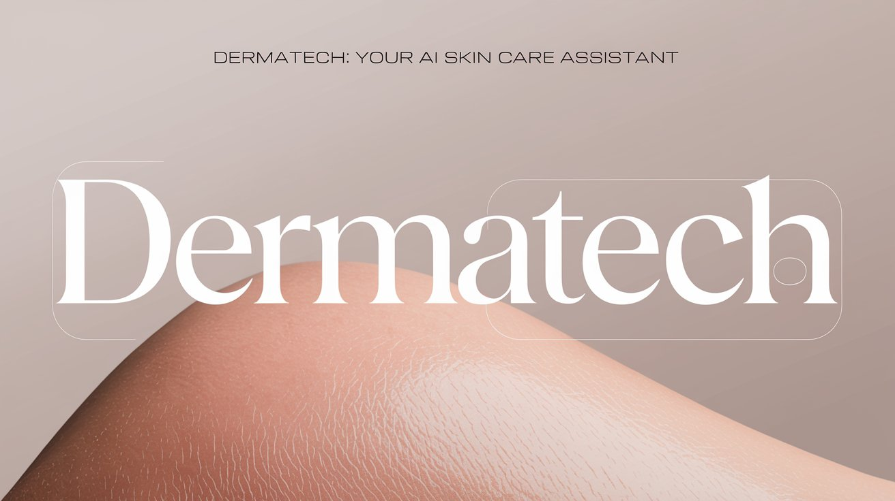
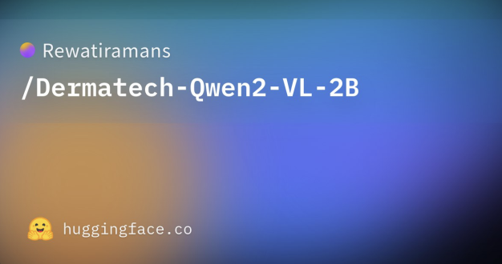
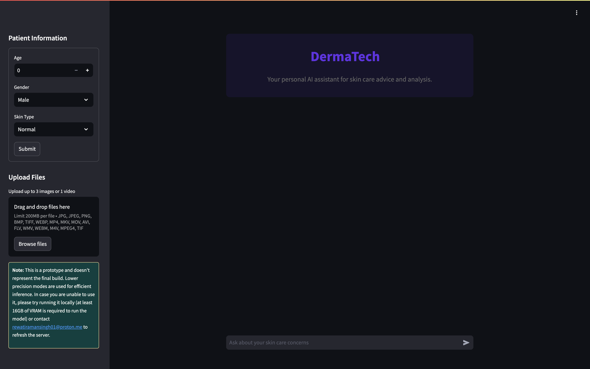
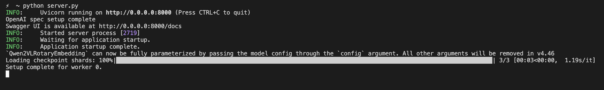
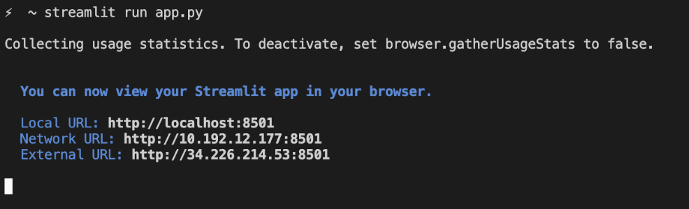
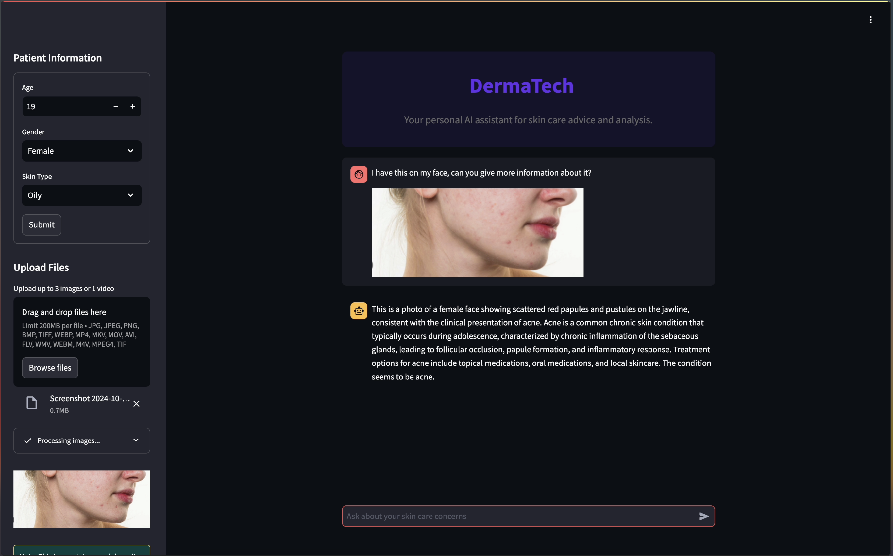

# DermaTech: Your AI-Powered Skincare Assistant



**DermaTech is a cutting-edge AI-powered application designed to provide personalized skincare advice and analysis.** Leveraging advanced image processing with visual transformer and sophisticated language understanding with Qwen 2 VL, trained on custom dataset. DermaTech offers preliminary skin condition assessments and empowers users to take proactive steps toward healthier skin.

This prototype harnesses multimodal generative AI to bridge the gap in access to dermatological care, particularly in resource-limited settings. DermaTech embodies innovation and accessibility, offering a glimpse into the future of personalized skincare.

---
### Our custom Hugging face model 
[](https://huggingface.co/Rewatiramans/Dermatech-Qwen2-VL-2B)

---

## Key Features

- **AI-Driven Image Analysis:** Utilizing the robust visual transformer, DermaTech processes images to identify potential skin conditions.

- **Intelligent Chatbot Interaction:** Powered by Qwen 2 VL, the chatbot gathers detailed information and provides tailored insights, trained on a cluster of publicly available datasets.

- **Personalized Diagnostics:** DermaTech analyzes user inputs and medical history to provide relevant responses.

- **Memory-Equipped Model:** Past conversations are stored in a vector database, allowing for evolving diagnostic assessments.

- **User-Friendly Interface:** A clean and intuitive interface enhances the user experience.



## Ways to experience the prototype
### 1. [Try it on Google Colab! ](https://colab.research.google.com/drive/1zW1DMFg62gyINLKpKo_1Y6cSZQeC_Jdj?usp=sharing)
---
### 2.  Getting Started Locally

Follow these steps to get started:

1. **Clone the Repository:**
   ```bash
   git clone https://github.com/ramanrewati/Dermatech
   ```

2. **Install Dependencies:**
   ```bash
   pip install -r requirements.txt
   ```

3. **Run the Server:**
   ```bash
   python server.py
   ```

   

4. **Launch the Application:**
   ```bash
   streamlit run app.py
   ```
   
---
### 3. Try it using this [link.](https://8502-01ja0kbxt4nk9yyw8x6j5hemea.cloudspaces.litng.ai/)

**After clicking on the link please wait for 5 minutes before prompting anything to let our serverless backend start and load the model.**

---
### Demo Video (click to play)
[](https://drive.google.com/file/d/1dwyKcieDizjPdghgm7KdW-KE1VfUQfXy/view?usp=sharing)

---

### Important Note:
This is a prototype and does not represent the final build. While impressive in its current form, ongoing development will refine its precision and capabilities. Running the app locally is recommended for the best experience. We welcome feedback and contributions!

